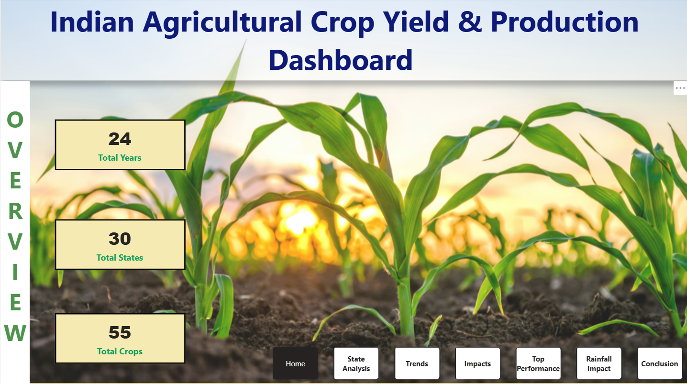
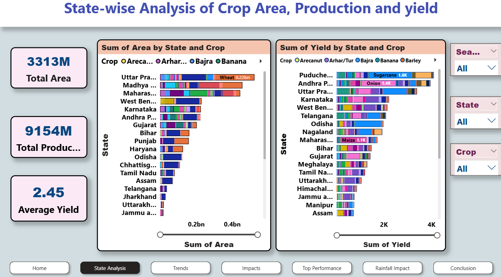
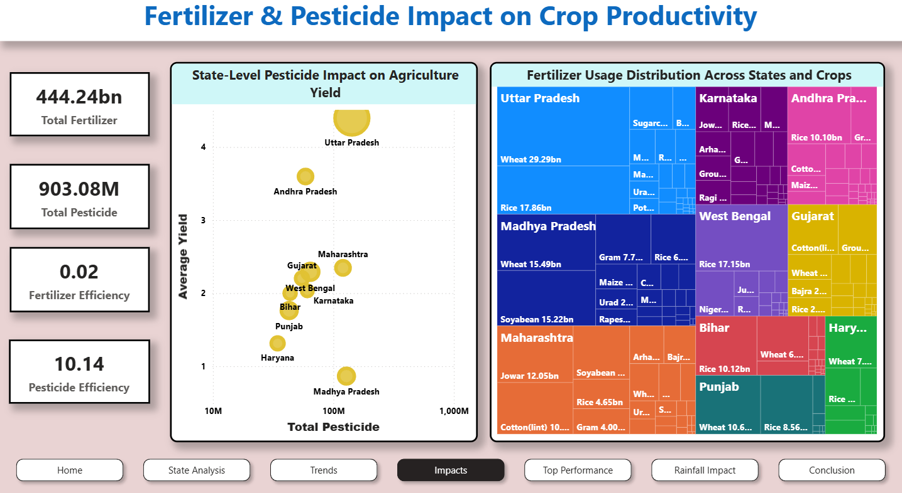
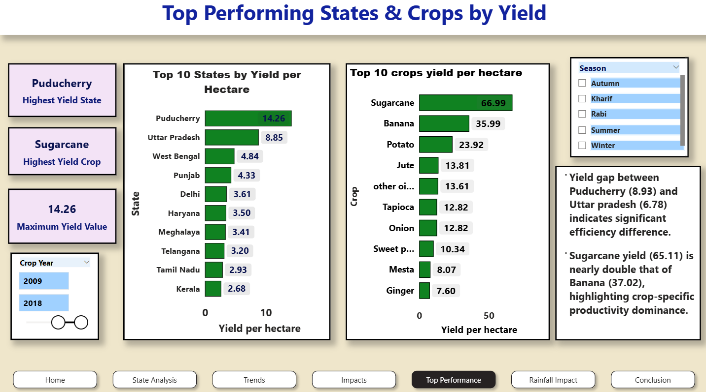
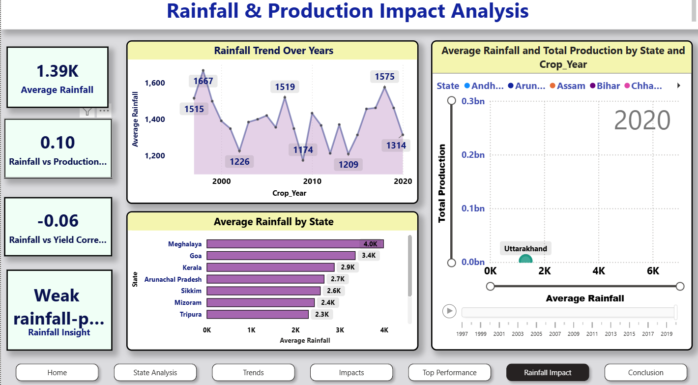

# Agriculture Crop Yield Dashboard – India

## Project Overview
This project analyzes agricultural crop yield trends across Indian states using Power BI.

Dataset Source:
[(https://www.kaggle.com/datasets/akshatgupta7/crop-yield-in-indian-states-dataset)](https://www.kaggle.com/datasets/akshatgupta7/crop-yield-in-indian-states-dataset)

## Tools Used
- Power BI
- DAX
- Power Query
- Data Cleaning
- Data Visualization

## Key Features
- State-wise crop production comparison
- Rainfall vs yield trend analysis
- Interactive slicers and filters
- KPI performance indicators

## Dashboard Preview

## Insights
- Regional variation in agricultural productivity
- Rainfall influence on crop yield patterns
- Identification of high-performing crop zones
